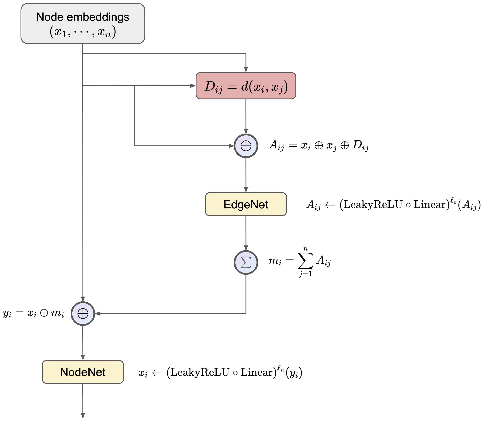

# Graph Neural Network Autoencoders Autoencoder for Jets
[](https://zenodo.org/badge/latestdoi/518371541)

# Overview

A graph autoencoder (GNNAE) for jets in particle physics implemented in PyTorch, mainly used as a baseline for [LGAE](https://github.com/zichunhao/lgn-autoencoder)

## Data
To download data:
1. Install `JetNet`:
    ```
    pip3 install jetnet; 
    ```
2. Run `preprocess.py`
    ```
    python utils/data/preprocess.py \
    --jet-types g q t w z \
    --save-dir "./data"
    ```

## Training
To train the model, run `train.py`. An example is provided in `examples/train.sh`.

## Architecture
Both the encoder and decoder are built upon the `GraphNet` architecture implemented in [models/graphnet.py]("models/graphnet.py"), which is a fully connected massage passing neural network. 
The message passing step of `GraphNet` is shown in the diagram below. Here, $d$ is any distance function, and `EdgeNet` and `NodeNet` are edge and node functions at the $t$-th message passing step, respectively, both of which are MLPs with LeakyReLU activation.

<center>

</center>